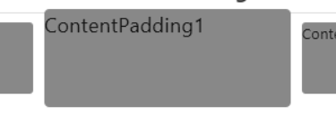

<h1 align="center">ComposeViews</h1>

<p align="center">Applicable to Compose-multiplatform(Jetpack), Supported targets: Android, iOS, Web(js, Wasm js), Desktop(Windows, Linux, macOS)</p>

<p align="center">


</p>

<div align="center">us English | <a href="https://github.com/ltttttttttttt/ComposeViews/blob/main/README_CN.md">cn 简体中文</a> | <a href="https://sakurajimamaii.github.io/ComposeViewsDocs/">detailed documentation</a></div>

## Views:

1. ComposePager
2. Banner
3. PagerIndicator
4. ImageBanner
5. RefreshLayout + PullToRefresh + VerticalRefreshableLayout
6. FlowLayout
7. ValueSelector + DateSelector
8. MenuFloatingActionButton
9. ChainScrollableComponent + ScrollableAppBar + SwipeToDismiss

<a href="https://github.com/ltttttttttttt/ComposeViews/blob/main/md_resource/compose_views_demo.apk">
View demo</a>

[](https://star-history.com/#ltttttttttttt/ComposeViews&Date)

## Version support

<table broder="1">
<tr><td>ComposeViews version</td><td>jetpack compose version</td><td>compose-multiplatform version</td><td>kotlin version</td></tr>
<tr><td></td><td>1.6.7</td><td>1.6.11</td><td>2.0.0+</td></tr>
<tr><td>1.6.0.4</td><td>1.6.1</td><td>1.6.0</td><td>1.9.22</td></tr>
<tr><td>1.5.10.5</td><td>1.5.4</td><td>1.5.10</td><td>1.9.20</td></tr>
<tr><td>1.5.1.5</td><td>1.5.0</td><td>1.5.1</td><td>1.9.0</td></tr>
<tr><td>1.5.0.3</td><td>1.5.0</td><td>1.5.0</td><td>1.9.0</td></tr>
<tr><td>1.4.0.14</td><td>1.4.0</td><td>1.4.0</td><td>1.8.20</td></tr>
<tr><td>1.3.11</td><td>1.3.3</td><td>1.3.1</td><td>1.8.10</td></tr>
<tr><td>1.3.9.1</td><td>1.3.3</td><td>1.3.0</td><td>1.8.0</td></tr>
<tr><td>1.3.5</td><td>1.2.1</td><td>1.2.1</td><td>1.7.20</td></tr>
</table>

## Add to your project

Your app or common dir, build.gradle.kts add:

version
= [](https://repo1.maven.org/maven2/io/github/ltttttttttttt/ComposeViews/)

```kotlin
dependencies {
    ...
    implementation("io.github.ltttttttttttt:ComposeViews:$version")//this, such as 1.6.11.2
}
```

## ComposePager

<div align=center>
    
    
</div>

<a href="https://github.com/ltttttttttttt/ComposeViews/blob/main/common_app/src/commonMain/kotlin/com/lt/common_app/ComposePagerActivity.kt">
sample</a>
<a href="https://github.com/ltttttttttttt/ComposeViews/blob/main/common_app/src/commonMain/kotlin/com/lt/common_app/ContentPaddingA.kt">
sample</a>

```kotlin
/**
 * Pager (Equivalent to the ViewPager in android)
 * @param pageCount Sum page count
 * @param modifier
 * @param composePagerState ComposePager's state
 * @param orientation Scroll orientation
 * @param userEnable Whether the user can scroll
 * @param pageCache The number of pagers cached on the left and right sides
 * @param scrollableInteractionSource Scroll state monitor
 * @param pagerKey Using key to improve performance, reduce recombination, and achieve the same effect as [LazyColumn#items#key]
 * @param clip Whether to crop the content area
 * @param contentTransformation Transform the Content of ComposePager
 * @param content Content of compose
 */
@Composable
fun ComposePager()
```

## Banner

<a href="https://github.com/ltttttttttttt/ComposeViews/blob/main/common_app/src/commonMain/kotlin/com/lt/common_app/BannerActivity.kt">
sample</a>

```kotlin
/**
 * [ComposePager] that can auto scroll
 * @param pageCount Sum page count
 * @param modifier
 * @param bannerState Banner's state
 * @param orientation Scroll orientation
 * @param userEnable Whether the user can scroll
 * @param autoScroll Whether to scroll automatically
 * @param autoScrollTime Auto scroll interval
 * @param bannerKey Using key to improve performance, reduce recombination, and achieve the same effect as [LazyColumn#items#key]
 * @param clip Whether to crop the content area
 * @param contentTransformation Transform the Content of ComposePager
 * @param content Content of compose
 */
@Composable
fun Banner()
```

## PagerIndicator

<div align=center></div>

<div align=center></div>

<a href="https://github.com/ltttttttttttt/ComposeViews/blob/main/common_app/src/commonMain/kotlin/com/lt/common_app/PagerIndicatorActivity.kt">
sample</a>

<a href="https://github.com/ltttttttttttt/ComposeViews/blob/main/common_app/src/commonMain/kotlin/com/lt/common_app/TextPagerIndicatorActivity.kt">
sample</a>

```kotlin
/**
 * Indicator for pager
 * @param size Number of indicator
 * @param offsetPercentWithSelectFlow The offset percentage of the selected indicator
 * @param selectIndexFlow The index of selected indicator
 * @param indicatorItem The indicator
 * @param selectIndicatorItem The selected indicator
 * @param modifier
 * @param margin Spacing between indicators
 * @param orientation Orientation of indicators
 * @param userCanScroll Whether the user can scroll
 */
@Composable
fun PagerIndicator()

/**
 * Text indicator for pager
 * @param texts The text list
 * @param offsetPercentWithSelectFlow The offset percentage of the selected indicator
 * @param selectIndexFlow The index of selected indicator
 * @param fontSize Font size of the text indicator
 * @param selectFontSize Font size of the selected text indicator
 * @param textColor Font color of the text indicator
 * @param selectTextColor Font color of the selected text indicator
 * @param selectIndicatorColor Color of the indicator
 * @param onIndicatorClick Click event of the text indicator
 * @param modifier
 * @param margin Spacing between the text indicators
 * @param userCanScroll Whether the user can scroll
 */
@Composable
fun TextPagerIndicator()
```

## ImageBanner

<a href="https://github.com/ltttttttttttt/ComposeViews/blob/main/common_app/src/commonMain/kotlin/com/lt/common_app/PagerIndicatorActivity.kt">
sample</a>

```kotlin
/**
 * [Banner] showing images
 * @param imageSize Number of images
 * @param imageContent Content of the images
 * @param indicatorItem The indicator, if null, do not display indicator
 * @param selectIndicatorItem The indicator, if null, do not display indicator
 * @param modifier
 * @param bannerState Banner's state
 * @param orientation Orientation of indicators
 * @param autoScroll Whether to scroll automatically
 * @param autoScrollTime Auto scroll interval
 * @param bannerKey Using key to improve performance, reduce recombination, and achieve the same effect as [LazyColumn#items#key]
 * @param clip Whether to crop the content area
 * @param contentTransformation Transform the Content of ComposePager
 */
@Composable
fun ImageBanner()
```

## RefreshLayout

<div align=center></div>

<a href="https://github.com/ltttttttttttt/ComposeViews/blob/main/common_app/src/commonMain/kotlin/com/lt/common_app/RefreshLayoutActivity.kt">
sample</a>

```kotlin
/**
 * The refreshed container can be dragged in any direction
 * @param refreshContent Refreshed content area
 * @param refreshLayoutState State of the [RefreshLayout]
 * @param modifier
 * @param refreshContentThreshold Refresh threshold for layout dragging
 * @param composePosition Set where the refreshed layout is located
 * @param contentIsMove Whether the content component moves with it on refresh
 * @param dragEfficiency The 'efficiency' of dragging
 * @param isSupportCanNotScrollCompose Whether to support non-scrollable components
 * @param userEnable Whether the user can drag
 * @param refreshingCanScroll Can I scroll during refresh
 * @param content Content of compose
 */
@Composable
fun RefreshLayout()

/**
 * Pull down to refresh
 * @param refreshLayoutState State of the [RefreshLayout]
 * @param modifier
 * @param refreshContent Refreshed content area
 * @param content Content of compose
 */
@Composable
fun PullToRefresh()

/**
 * Pull down and up refresh components
 * @param topRefreshLayoutState State of the top of the [RefreshLayout]
 * @param bottomRefreshLayoutState State of the bottom of the [RefreshLayout]
 * @param modifier
 * @param topRefreshContent Refreshed content area of top
 * @param bottomIsLoadFinish Bottom is it loaded
 * @param bottomRefreshContent Refreshed content area of bottom
 * @param content Content of compose
 */
@Composable
fun VerticalRefreshableLayout()
```

## FlowLayout

<div align=center></div>

<a href="https://github.com/ltttttttttttt/ComposeViews/blob/main/common_app/src/commonMain/kotlin/com/lt/common_app/FlowLayoutActivity.kt">
sample</a>

```kotlin
/**
 * Linear layout with word wrapping
 * @param modifier
 * @param orientation Direction of arrangement
 * @param horizontalAlignment Alignment of horizontal
 * @param verticalAlignment Alignment of vertical
 * @param horizontalMargin Margin of horizontal
 * @param verticalMargin Margin of vertical
 * @param maxLines How many lines can be placed
 * @param content Content of compose
 */
@Composable
fun FlowLayout()

/**
 * [FlowLayout] that can automatically determine the selected state
 */
@Composable
fun LabelsFlowLayout()
```

## ValueSelector and DateSelector

<div align=center></div>

<a href="https://github.com/ltttttttttttt/ComposeViews/blob/main/common_app/src/commonMain/kotlin/com/lt/common_app/DateSelectorA.kt">
sample</a>

```kotlin
/**
 * Date Selector
 * @param state DateSelector's state
 * @param modifier
 * @param isLoop Whether the value list is loop
 */
@Composable
fun DateSelector()

/**
 * Value selector
 */
@Composable
fun ValueSelector()
```

## MenuFloatingActionButton

<div align=center></div>

<a href="https://github.com/ltttttttttttt/ComposeViews/blob/main/common_app/src/commonMain/kotlin/com/lt/common_app/MenuFabActivity.kt">
sample</a>

```kotlin
/**
 * Floating action button
 * @param icon Menu icon
 * @param label Menu text
 * @param srcIconColor Icon color
 * @param labelTextColor Label text color
 * @param labelBackgroundColor Background color of label text
 * @param fabBackgroundColor Background color of floating action button
 */
@Composable
fun MenuFloatingActionButton()
```

## ChainScrollableComponent

<div align=center></div>

<div align=center></div>

<a href="https://github.com/ltttttttttttt/ComposeViews/blob/main/common_app/src/commonMain/kotlin/com/lt/common_app/ScrollableAppBarActivity.kt">
sample</a>

<a href="https://github.com/ltttttttttttt/ComposeViews/blob/main/common_app/src/commonMain/kotlin/com/lt/common_app/SwipeToDismissActivity.kt">
sample</a>

```kotlin
/**
 * Chain scrollable component
 * @param minScrollPosition Minimum scroll position
 * @param maxScrollPosition Maximum scroll position
 * @param chainContent Content of chain
 * @param modifier
 * @param onScrollStop Callback of scroll stop event
 * @param composePosition Set the position of the top bar layout
 * @param chainMode Chain mode
 * @param content Content of compose
 */
@Composable
fun ChainScrollableComponent()

/**
 * Scalable top navigation bar
 * @param title Title of top bar
 * @param background Background of top bar
 * @param modifier
 * @param onScrollStop Callback of scroll stop event
 * @param minScrollPosition Minimum scroll position
 * @param maxScrollPosition Maximum scroll position
 * @param navigationIcon Icon of top bar
 * @param composePosition Set the position of the top bar layout
 * @param chainMode Chain mode
 * @param content Content of compose
 */
@Composable
fun ScrollableAppBar()

/**
 * Swipe to delete controls
 * @param minScrollPosition Minimum scroll position
 * @param maxScrollPosition Maximum scroll position
 * @param backgroundContent Content of background
 * @param modifier
 * @param contentIsMove Does content follow
 * @param content Content of compose
 */
@Composable
fun SwipeToDismiss()
```

## More

<div align=center></div>

<div align=center></div>

<div align=center></div>

```kotlin
/**
 * Image viewer
 */
@Composable
fun ImageViewer()

/**
 * Zoom layout
 */
@Composable
fun ZoomLayout()

/**
 * Button without click effect
 */
@Composable
fun ButtonWithNotRipple()

/**
 * Star bar
 */
@Composable
fun StarBar()

/**
 * Progress bar
 */
@Composable
fun BasicsProgressBar()

/**
 * More convenient and easy to use the [TextField]
 */
@Composable
fun GoodTextField()

/**
 * More convenient and easy to use the [TextField], for entering passwords
 * Api is almost the same as the [GoodTextField]
 */
@Composable
fun PasswordTextField()

/**
 * Offset by a percentage of its own width or height
 */
fun Modifier.offsetPercent()

/**
 * ComposePager-based navigation
 * Navigation relative to jetpack:
 * 1.Easier to use and more single function
 * 2.All state of each page can be saved
 * 3.no animation
 */
@Composable
fun PagerNav()
```

## Config

```kotlin
//Set multiple languages, get the system language by default
Strings.setLanguage("en")
```

## contact information

Kotlin Communication Group(QQ): 101786950

## thank

<h4>Finally, thanks to <a href="https://www.jetbrains.com/?from=ltviews" target="_blank">JetBrains</a>
for supporting the project<h4>
