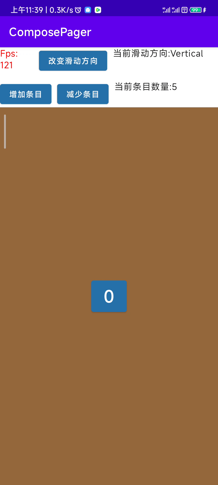
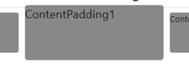
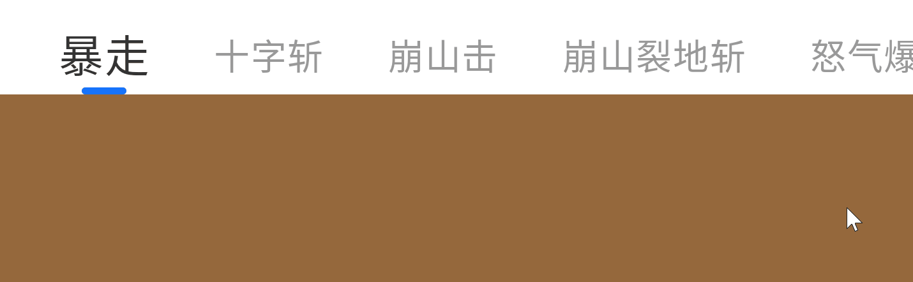
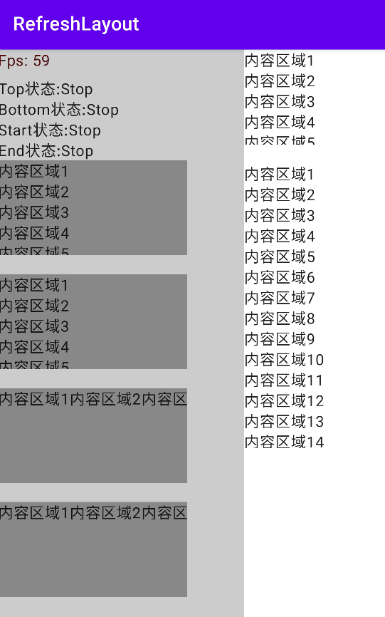
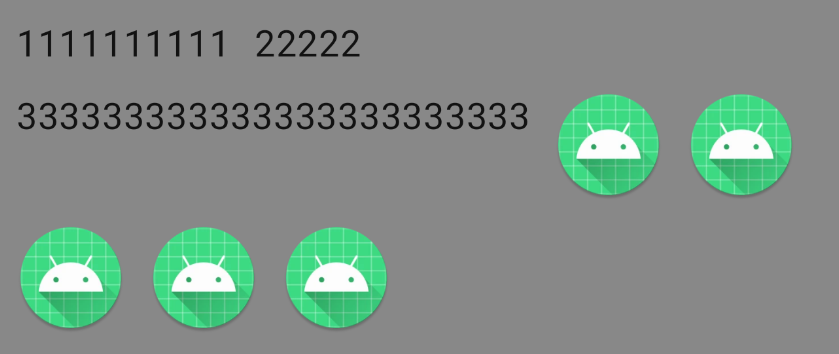
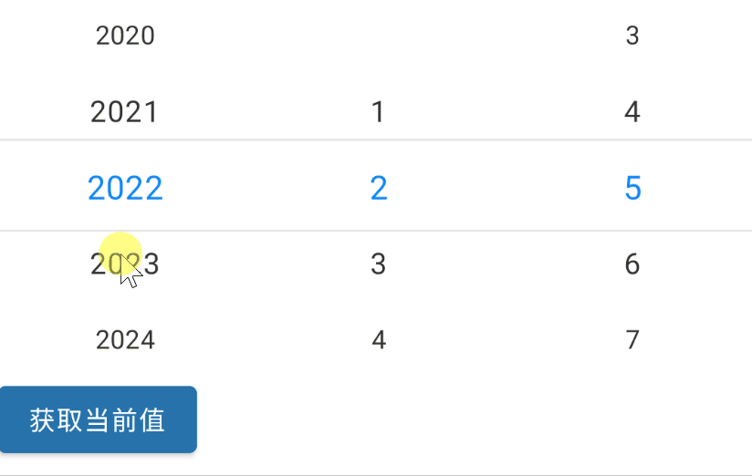
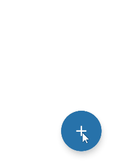
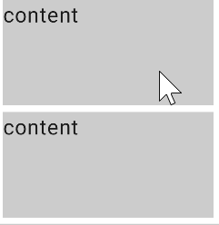
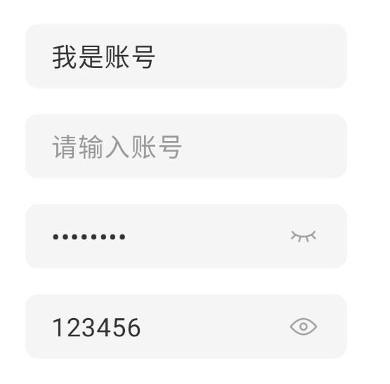

<h1 align="center">ComposeViews</h1>

<p align="center">适用于 Compose-multiplatform(Jetpack), 支持的目标: Android, iOS, Web(js, Wasm js), Desktop(Windows, Linux, macOS)</p>

<p align="center">


</p>

<div align="center"><a href="https://github.com/ltttttttttttt/ComposeViews/blob/main/README.md">us English</a> | cn 简体中文 | <a href="https://sakurajimamaii.github.io/ComposeViewsDocs/">详细文档(us)</a></div>

## 目前提供的View

1. ComposePager
2. Banner
3. PagerIndicator
4. ImageBanner
5. RefreshLayout + PullToRefresh + VerticalRefreshableLayout
6. FlowLayout
7. ValueSelector + DateSelector
8. MenuFloatingActionButton
9. ChainScrollableComponent + ScrollableAppBar + SwipeToDismiss

<a href="https://github.com/ltttttttttttt/ComposeViews/blob/main/md_resource/compose_views_demo.apk">
查看demo.apk</a>

[](https://star-history.com/#ltttttttttttt/ComposeViews&Date)

## 版本支持

<table broder="1">
<tr><td>ComposeViews version</td><td>jetpack compose version</td><td>compose-multiplatform version</td><td>kotlin version</td></tr>
<tr><td></td><td>1.8.0</td><td>1.8.0</td><td>2.1.10+</td></tr>
<tr><td>1.7.0.1</td><td>1.7.1</td><td>1.7.0</td><td>2.0.0+</td></tr>
<tr><td>1.6.11.4</td><td>1.6.7</td><td>1.6.11</td><td>2.0.0+</td></tr>
<tr><td>1.6.0.4</td><td>1.6.1</td><td>1.6.0</td><td>1.9.22</td></tr>
<tr><td>1.5.10.5</td><td>1.5.4</td><td>1.5.10</td><td>1.9.20</td></tr>
<tr><td>1.5.1.5</td><td>1.5.0</td><td>1.5.1</td><td>1.9.0</td></tr>
<tr><td>1.5.0.3</td><td>1.5.0</td><td>1.5.0</td><td>1.9.0</td></tr>
<tr><td>1.4.0.14</td><td>1.4.0</td><td>1.4.0</td><td>1.8.20</td></tr>
</table>

## 快速入门

在app或common模块目录内的build.gradle.kts内添加:

version
= [](https://repo1.maven.org/maven2/io/github/ltttttttttttt/ComposeViews/)

```kotlin
dependencies {
    ...
    implementation("io.github.ltttttttttttt:ComposeViews:$version")//this,比如1.6.11.2
}
```

## ComposePager

<div align=center>
    
    
</div>

<a href="https://github.com/ltttttttttttt/ComposeViews/blob/main/common_app/src/commonMain/kotlin/com/lt/common_app/ComposePagerActivity.kt">
示例代码</a>
<a href="https://github.com/ltttttttttttt/ComposeViews/blob/main/common_app/src/commonMain/kotlin/com/lt/common_app/ContentPaddingA.kt">
示例代码</a>

```kotlin
/**
 * Pager (类似于安卓中的ViewPager)
 * @param pageCount 一共有多少页
 * @param modifier 修饰
 * @param composePagerState ComposePager的状态
 * @param orientation 滑动的方向
 * @param userEnable 用户是否可以滑动,等于false时用户滑动无反应,但代码可以执行翻页
 * @param pageCache 左右两边的页面缓存,默认左右各缓存1页,但不能少于1页(不宜过大)
 * @param scrollableInteractionSource 滚动状态监听,可以用来监听:用户开始(结束,取消)滑动等事件,使用可以参考[Banner]
 * @param pagerKey 使用key来提高性能,减少重组,效果等同于[LazyColumn#items#key]
 * @param clip 是否对内容区域进行裁剪
 * @param contentTransformation 变换ComposePager的Content
 * @param content compose内容区域
 */
@Composable
fun ComposePager()
```

## Banner

<a href="https://github.com/ltttttttttttt/ComposeViews/blob/main/common_app/src/commonMain/kotlin/com/lt/common_app/BannerActivity.kt">
示例代码</a>

```kotlin
/**
 * 可以自动循环轮播的ComposePager
 * @param pageCount 一共有多少页
 * @param modifier 修饰
 * @param bannerState Banner的状态
 * @param orientation 滑动的方向
 * @param userEnable 用户是否可以滑动,等于false时用户滑动无反应,但代码可以执行翻页
 * @param autoScroll 是否自动滚动
 * @param autoScrollTime 自动滚动间隔时间
 * @param bannerKey 使用key来提高性能,减少重组,效果等同于[LazyColumn#items#key]
 * @param clip 是否对内容区域进行裁剪
 * @param contentTransformation 变换ComposePager的Content
 * @param content compose内容区域
 */
@Composable
fun Banner()
```

## PagerIndicator

<div align=center></div>

<div align=center></div>

<a href="https://github.com/ltttttttttttt/ComposeViews/blob/main/common_app/src/commonMain/kotlin/com/lt/common_app/PagerIndicatorActivity.kt">
示例代码</a>

<a href="https://github.com/ltttttttttttt/ComposeViews/blob/main/common_app/src/commonMain/kotlin/com/lt/common_app/TextPagerIndicatorActivity.kt">
示例代码</a>

```kotlin
/**
 * 适用于Pager的指示器
 * @param size 指示器数量
 * @param offsetPercentWithSelectFlow 选中的指示器的偏移百分比
 * @param selectIndexFlow 选中的索引
 * @param indicatorItem 未被选中的指示器
 * @param selectIndicatorItem 被选中的指示器
 * @param modifier 修饰
 * @param margin 指示器之间的间距
 * @param orientation 指示器排列方向
 * @param userCanScroll 用户是否可以滚动
 */
@Composable
fun PagerIndicator()

/**
 * 适用于Pager的文本指示器
 * @param texts 文本列表
 * @param offsetPercentWithSelectFlow 选中的指示器的偏移百分比
 * @param selectIndexFlow 选中的索引
 * @param fontSize 未被选中的文字大小
 * @param selectFontSize 被选中的文字大小
 * @param textColor 未被选中的文字颜色
 * @param selectTextColor 被选中的文字颜色
 * @param selectIndicatorColor 指示器的颜色
 * @param onIndicatorClick 指示器的点击事件
 * @param modifier 修饰
 * @param margin 指示器之间的间距(两边也有,保证即使选中的指示器较大,也不容易超出控件区域)
 * @param userCanScroll 用户是否可以滚动
 */
@Composable
fun TextPagerIndicator()
```

## ImageBanner

<a href="https://github.com/ltttttttttttt/ComposeViews/blob/main/common_app/src/commonMain/kotlin/com/lt/common_app/PagerIndicatorActivity.kt">
示例代码</a>

```kotlin
/**
 * 展示图片的Banner
 * @param imageSize 图片数量
 * @param imageContent 放置图片的content
 * @param indicatorItem 未被选中的指示器,如果为null则不展示指示器
 * @param selectIndicatorItem 被选中的指示器,如果为null则不展示指示器
 * @param modifier 修饰
 * @param bannerState Banner的状态
 * @param orientation 滑动的方向
 * @param autoScroll 是否自动滚动
 * @param autoScrollTime 自动滚动间隔时间
 * @param bannerKey 使用key来提高性能,减少重组,效果等同于[LazyColumn#items#key]
 * @param clip 是否对内容区域进行裁剪
 * @param contentTransformation 变换ComposePager的Content
 */
@Composable
fun ImageBanner()
```

## RefreshLayout

<div align=center></div>

<a href="https://github.com/ltttttttttttt/ComposeViews/blob/main/common_app/src/commonMain/kotlin/com/lt/common_app/RefreshLayoutActivity.kt">
示例代码</a>

```kotlin
/**
 * 可以任意方向拖动刷新的容器
 * @param refreshContent 刷新布局内容区域
 * @param refreshLayoutState RefreshLayout的状态,可以调用[rememberRefreshLayoutState]方法创建state并传入一个刷新时触发的回调
 * @param modifier 修饰
 * @param refreshContentThreshold 刷新布局拖动的阈值,拖动超过多少松开才算真的刷新,如果为null,表示为[refreshContent]的宽或高
 * @param composePosition 设置刷新布局所在的位置,并且间接指定了滑动方向
 * @param contentIsMove content组件是否在刷新时跟着移动,true的效果类似于PullToRefresh,false的效果类似于SwipeRefreshLayout
 * @param dragEfficiency 拖动的'有效率',比如默认是手指拖动20px,只能拖出10px
 * @param isSupportCanNotScrollCompose 是否需要支持无法滚动的组件,为true的话内部会套一层可滚动组件
 * @param userEnable 用户是否可以拖动,等于false时用户拖动无反应,但代码可以修改刷新状态
 * @param refreshingCanScroll 刷新中是否可以滚动
 * @param content compose内容区域
 */
@Composable
fun RefreshLayout()

/**
 * 下拉刷新
 * @param refreshLayoutState RefreshLayout的状态
 * @param modifier 修饰
 * @param refreshContent 刷新布局内容区域
 * @param content compose内容区域
 */
@Composable
fun PullToRefresh()

/**
 * 下拉刷新+上拉加载,如果内部不支持上下滑动的话,则无法使用(可以给modifier加上[verticalScroll]修饰)
 * @param topRefreshLayoutState top的刷新布局的state,可以调用[rememberRefreshLayoutState]方法创建state并传入一个刷新时触发的回调
 * @param bottomRefreshLayoutState bottom的刷新布局的state,可以调用[rememberRefreshLayoutState]方法创建state并传入一个刷新时触发的回调
 * @param modifier 修饰
 * @param topRefreshContent top的刷新布局的content,有默认样式,可以传入lambda自定义
 * @param bottomIsLoadFinish bottom刷新布局是否刷新完成
 * @param bottomRefreshContent bottom的刷新布局的content,有默认样式,可以传入lambda自定义
 * @param content 内容
 */
@Composable
fun VerticalRefreshableLayout()
```

## FlowLayout

<div align=center></div>

<a href="https://github.com/ltttttttttttt/ComposeViews/blob/main/common_app/src/commonMain/kotlin/com/lt/common_app/FlowLayoutActivity.kt">
示例代码</a>

```kotlin
/**
 * 可以自动换行的线性布局
 * @param modifier 修饰
 * @param orientation 排列的方向,[Orientation.Horizontal]时会先横向排列,一排放不下会换到下一行继续横向排列
 * @param horizontalAlignment 子级在横向上的位置
 * @param verticalAlignment 子级在竖向上的位置
 * @param horizontalMargin 子级与子级在横向上的间距
 * @param verticalMargin 子级与子级在竖向上的间距
 * @param maxLines 最多能放多少行(或列)
 * @param content compose内容区域
 */
@Composable
fun FlowLayout()

/**
 * 可以自动确定选中状态的[FlowLayout]
 */
@Composable
fun LabelsFlowLayout()
```

## ValueSelector and DateSelector

<div align=center></div>

<a href="https://github.com/ltttttttttttt/ComposeViews/blob/main/common_app/src/commonMain/kotlin/com/lt/common_app/DateSelectorA.kt">
示例代码</a>

```kotlin
/**
 * 日期选择器
 * @param state DateSelector的状态
 * @param modifier 修饰
 * @param isLoop 值列表是否可循环
 */
@Composable
fun DateSelector()

/**
 * 值选择器
 */
@Composable
fun ValueSelector()
```

## MenuFloatingActionButton

<div align=center></div>

<a href="https://github.com/ltttttttttttt/ComposeViews/blob/main/common_app/src/commonMain/kotlin/com/lt/common_app/MenuFabActivity.kt">
示例代码</a>

```kotlin
/**
 * 带菜单的Fab
 * @param icon 菜单图标
 * @param label 菜单提示文本
 * @param srcIconColor 图标颜色
 * @param labelTextColor 提示文本内容颜色
 * @param labelBackgroundColor 提示文本内容区域背景色
 * @param fabBackgroundColor Fab按钮背景色
 */
@Composable
fun MenuFloatingActionButton()
```

## ChainScrollableComponent

<div align=center></div>

<div align=center></div>

<a href="https://github.com/ltttttttttttt/ComposeViews/blob/main/common_app/src/commonMain/kotlin/com/lt/common_app/ScrollableAppBarActivity.kt">
示例代码</a>

<a href="https://github.com/ltttttttttttt/ComposeViews/blob/main/common_app/src/commonMain/kotlin/com/lt/common_app/SwipeToDismissActivity.kt">
示例代码</a>

```kotlin
/**
 * 链式(联动)滚动组件
 * @param minScrollPosition 最小滚动位置(距离指定方向的顶点)
 * @param maxScrollPosition 最大滚动位置(距离指定方向的顶点)
 * @param chainContent 链式(联动)滚动的compose组件,scrollOffset: 滚动位置(位于最小和最大之间)
 * @param modifier 修饰
 * @param onScrollStop 停止滚动时回调
 * @param composePosition 设置bar布局所在的位置,并且间接指定了滑动方向
 * @param chainMode 联动方式
 * @param content compose内容区域,需要内容是在相应方向可滚动的,并且需要自行给内容设置相应方向的PaddingValues或padding
 */
@Composable
fun ChainScrollableComponent()

/**
 * 可伸缩顶部导航栏
 * @param title 顶部导航栏标题
 * @param background 背景图片
 * @param modifier 修饰
 * @param onScrollStop 停止滚动时回调
 * @param minScrollPosition 最小滚动位置(距离指定方向的顶点)
 * @param maxScrollPosition 最大滚动位置(距离指定方向的顶点)
 * @param navigationIcon 顶部导航栏图标，默认为返回键
 * @param composePosition 设置bar布局所在的位置,并且间接指定了滑动方向
 * @param chainMode 联动方式
 * @param content compose内容区域,需要内容是在相应方向可滚动的,并且需要自行给内容设置相应方向的PaddingValues或padding
 */
@Composable
fun ScrollableAppBar()

/**
 * 滑动删除控件
 * @param minScrollPosition 最小滚动位置(距离指定方向的顶点)
 * @param maxScrollPosition 最大滚动位置(距离指定方向的顶点)
 * @param backgroundContent 等待拖出的compose内容区域
 * @param modifier 修饰
 * @param contentIsMove compose内容区域是否跟着移动
 * @param content compose内容区域,需要内容是横向可滚动的,并且需要自行给内容设置相应方向的PaddingValues或padding
 */
@Composable
fun SwipeToDismiss()
```

## 更多

<div align=center></div>

<div align=center></div>

<div align=center></div>

```kotlin
/**
 * 图片预览
 */
@Composable
fun ImageViewer()

/**
 * 可以缩放的布局
 */
@Composable
fun ZoomLayout()

/**
 * 没有点击效果的Button
 */
@Composable
fun ButtonWithNotRipple()

/**
 * 星星选择和展示控件
 */
@Composable
fun StarBar()

/**
 * 进度条控件
 */
@Composable
fun BasicsProgressBar()

/**
 * 更方便易用的TextField(文本输入框)
 */
@Composable
fun GoodTextField()

/**
 * 更方便易用的TextField,适用于输入密码的情况
 * api和[GoodTextField]基本一样
 */
@Composable
fun PasswordTextField()

/**
 * 偏移自身宽度或高度的百分比
 */
fun Modifier.offsetPercent()

/**
 * 以ComposePager为基础的导航
 * 相对于jetpack的导航:
 * 1.使用更简单,功能更单一
 * 2.可保存每个页面的所有状态
 * 3.无动画
 */
@Composable
fun PagerNav()
```

## 配置

```kotlin
//设置多语言,默认获取系统语言
Strings.setLanguage("zh")
```

## 联系方式

Kotlin交流群(QQ): 101786950

## 感谢

<h4>最后感谢<a href="https://www.jetbrains.com/?from=ltviews" target="_blank">JetBrains</a>对于项目提供的支持！<h4>
